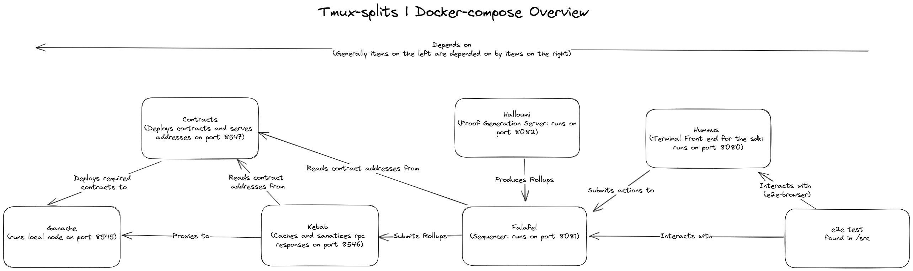

# End to End

This folder contains repositories that aid in performing end to end tests on the system. All of the tests in the `src/` folder will run at the end of the CI pipeline. But can be run locally by following the instructions provided.

Each test will require compilation and running a running instance of:

- ganache
- contracts
- barretenberg
- kebab
- halloumi
- falafel
- hummus

## General testing architecture



If you need to quickly run an end to end test, there are series of scripts you can run which will configure infrastructure to run the tests. There are two flavours to do this:

1. docker-compose - container orchestration
2. Tmux - shell multiplexing

### Using Docker-compose

Before running docker-compose it is recommended that you run the `bootstrap_docker` script in the root of the monorepo. This will build all of the dependencies required.

### Docker Environment Variables

Inside the `scripts/docker-compose.yml` file you will notice that there are a number of environment variables.

- PROVERLESS:
- VK: This represents the type of verification key that will be used, it can be one of the following options:
  1. VerificationKey1x1 - A 1 by 1 verification key will be used.
  - Corresponds to the `contracts/src/core/verifier/instances/Verifier1x1.sol` contract.
  2. VerificationKey28x32 - A 28 by 32 verification key will be used, as is used in production.
  - corresponds to the `contracts/src/core/verifier/instances/Verifier28x32.sol` contract.
  3. MockVerifier - A verifier that will always return true.
- PROVERLESS - A mock prover is used, should always be true if no prover is provided.
- NUM_INNER_ROLLUP_TXS - The number of rollups that will be in the inner rollup.
- NUM_OUTER_ROLLUP_PROOFS - The number of inner rollups that will be rolled into the final rollup.
- TEST - The test that wil be run - see `end-to-end/src` for available options.

To automatically set the environment variables to sensible defaults, you can run `./run_tests` inside the `scripts` folder.  
The majority of the test suite uses the defaults, ( you can check `.circleci/config.yml` to see what each test runs with in CI.)

### Using Tmux

> NOTE: Before running this you will need to run `.bootstrap.sh` in the route of the repo, this will build all of the required binaries.

In order to run the test suite through tmux, you can use the following shell command from the root of the repo. (Not in this end_to_end folder!).

```shell
bash scripts/tmux-scripts ${test-name}
```

If a test name is not included an instance of each service will be booted up.  
If a test name IS provided, then it will run the tests (pattern matched).

**What happens in this script?**
The script splits tmux into a number of panes.

1. Pane one contains (behind)

- An instance of ganache running on 8545
- An shell that deploys contracts then serves them on port 8547

2. Pane two contains (what you see)

- Kebab running on 8546
- Halloumi running on 8083
- Falafel running on 8082
- Hummus running on 8080
- A final window for running the e2e test

### Using Docker Compose

Simply run `docker-compose up` inside the `scripts` folder.  
All of the images are tagged by what is used within the CI build. If you would like to re-build any container that is depended on you will need to manually tag it with the name that is used in the build system.

For example if you have changed the contracts and would like to perform a test using docker-compose you will have to rebuild as follows:

```bash
# Inside the /contracts directory
docker build . -t 278380418400.dkr.ecr.eu-west-2.amazonaws.com/contracts
```

Note: The bootstrap_docker script automatically does this for all of the base images.

If you would like the rebuild something inside `yarn-project` there is a slightly different approach required. You should build with docker's base context as `yarn-project` then build anything else relative to this. e.g. for rebuilding falafel.

```bash
# Inside /yarn-project
docker build . -f falafel/Dockerfile -t 278380418400.dkr.ecr.eu-west-2.amazonaws.com/falafel
```
